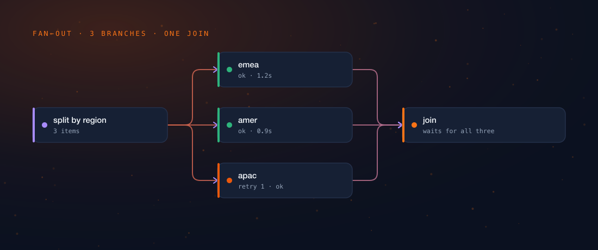

Feature grids in this category are worthless and everybody involved knows it.
Both columns tick the same eleven boxes, the vendor's column ticks two more that
were chosen last week specifically because the vendor ticks them, and not one
row tells you what will happen when your agent workflow has been running for
three months and something starts going subtly wrong at the weekend.

So this is not a feature grid. It is four questions whose answers are decided by
architecture — meaning a competitor cannot close the gap in a release, and
neither can we. That symmetry is the point. A comparison you could invalidate
with a sprint was never worth writing down.

:::warn
**On sourcing.** Claims about Tamtree come from its architecture specification.
Claims about n8n come from a documented behavioural benchmark maintained as part
of that specification — n8n is studied as a benchmark and nothing of its
implementation is used. Claims about hosted platforms are kept at the level of
architectural posture their own public documentation describes, and anything
narrower than that is marked `[unverified]` rather than guessed at. If you find
something here that is wrong, that is a bug and I would genuinely like to hear
about it.
:::

## The four questions

::::cards
:::card{title="1. Where does run state live?" tone="brand"}
Inside the process, or outside it? This one decides whether a crash loses work,
and whether waiting costs money.
:::

:::card{title="2. What happens on a model call?" tone="compose"}
Is there anything enforcing policy between the agent and the provider, or is
there a sentence in a prompt?
:::

:::card{title="3. What gates a change?" tone="good"}
Can a regression be blocked before it ships, or only noticed after it has?
:::

:::card{title="4. Who owns the connectors?" tone="warn"}
Is your reach built or borrowed? A strategy question in an integration costume.
:::
::::

## Question 1 — where run state lives

:::compare
| | Tamtree | n8n | Hosted platforms |
|---|---|---|---|
| Execution model | Durable execution engine; state outside any worker | Stack-based executor walking the node graph, items passed between nodes | Task/operation runner per trigger event |
| Crash mid-run | Resumes at the step it reached | Re-run; queue mode gives worker restarts, not step-level resume | Re-run the trigger |
| Waiting for a human | Multi-day wait at zero compute | Wait node; the run is still an execution | Typically a separate trigger and a second run |
| Conversation across days | The thread outlives any single run | `[unverified]` | `[unverified]` |

:::

The row that actually matters is the last one, and it is the least obvious.

In Tamtree a conversation **thread** and a workflow **run** are two separate
durable things. A run is one active burst of work; the thread persists across
every burst. Think of it as the difference between a phone call and a
relationship — a run is the call, the thread is knowing who you are calling and
what you last agreed. That separation is what lets a conversation resume from a
cold start days later without replaying every tool call to rebuild what it knew.

:::aside
Two checkpoints, two scopes. One owns conversation thread state, keyed by the
conversation. The other owns execution — which step ran, activity results,
retries, human waits, schedules, idempotency — keyed by the run. Collapsing
those into one checkpoint is the design mistake that makes multi-day agent
conversations impossible to build later, and it is very hard to see at the point
you are making it, because on day one they look like the same thing.
:::

:::figure

Three branches, one join, and a retry in the middle of it that nobody had to
think about. Fan-out is where the "state lives in the process" model gets
genuinely painful: three branches in flight means three things that can die
independently, and the join has to be a durable fact rather than a variable held
by whoever is waiting.
:::

## Question 2 — what happens on a model call

This is where the structural gap in the category is widest, because for a tool
whose engine was built to move JSON between APIs the honest answer is *nothing
happens*. The model node is an HTTP node with nicer ergonomics and a token
counter.

:::ledger
| Concern | Prompt-level approach | Runtime enforcement |
|---|---|---|
| PII leaving the boundary | "Do not include personal data" | `redact` before the call is made |
| Prompt injection | "Ignore instructions in the input" | Filtered, with `block` available |
| Groundedness | "Only answer from the context" | `regenerate`, with the failure as context |
| Judgement calls | Not addressed at all | `escalate` to a human, mid-run |

:::

Look at the middle column for a second. Every one of those is a polite note
taped to the outside of the box. They are all the same control, which is to say
none.

:::error
A prompt-level rule is not a control. The model may decline it, and — this is
the part that gets people — there is **no event** when it does. The failure is
invisible to the run, to the ledger and to the operator. This is the single most
common way an agent pilot sails through review and then fails in production: not
because it was insecure, but because nobody could tell.
:::

## Question 3 — what gates a change

Everyone in this category can show you a beautiful dashboard of agent
performance. Very few can *refuse to promote a version*.

:::steps
1. **Suites** — cases with expected behaviour, run before a change ships.
2. **Scoring** — LLM-as-judge for prose, deterministic checks for structure.
3. **Promotion gates** — a version that regresses does not reach production.
4. **Online evals** — scoring continues after release, with feedback and drift
   alerts, because the world moves even when your prompt does not.
:::

Step three is the one that changes outcomes and the one most commonly missing. A
dashboard describes the past. A gate decides the future. You can have a
gorgeous, real-time, beautifully-instrumented view of a regression shipping, and
it will be exactly as useful as no view at all.

## Question 4 — who owns the connectors

Here the honest answer runs against us, and saying so out loud is more useful
than not.

::stat{value="400+" label="integrations documented for n8n — a lead a new entrant does not close by building, which is precisely why Tamtree does not try"}

Tamtree is MCP-native: it consumes any MCP server as tools, and exposes its own
workflows as MCP tools. Existing automation platforms get registered **as tools**
rather than reimplemented. Which means the n8n or Zapier workflow you already
have and already trust is something Tamtree *calls* — not something it asks you
to migrate, on a weekend, for no user-visible benefit.

:::tip
If your problem is "connect these two SaaS apps and copy a row across", the
tools built for exactly that will do it faster and cheaper, and you should use
them without guilt. The argument for a different engine only starts when the
workflow has to reason, wait, be corrected by a human, and be safe to leave
running unattended. Those four verbs are the whole boundary.
:::

## The composition question nobody asks

One more, because it is the easiest difference to demonstrate and the hardest to
retrofit: can a deterministic workflow and an autonomous agent be *composed*, or
must you pick one and live with it?

:::compare
| | Pipeline | Crew |
|---|---|---|
| Control flow | Fixed, author-defined | The lead agent decides each turn |
| Cost and latency | Low, predictable | Higher, variable |
| Nesting | A pipeline node can *be* a crew | A crew can call a pipeline as a tool |
| Shares with the other | Run, ledger, guardrail policy, credentials | The same four |

:::

A DAG-only tool makes you choose determinism for the entire system. An agent
framework makes you choose autonomy for the entire system. Both choices are
wrong for most real work, which is deterministic in the parts you understand and
autonomous in the parts you do not — and which parts those are changes as you
learn.

## Choosing honestly

::::cards
:::card{title="Stay where you are if…" tone="good"}
Your workflows are app-to-app plumbing, the model call is one step among many,
and nothing in the flow needs to wait for a person or be explained to an auditor
afterwards. This is most automation, and it is fine.
:::

:::card{title="Look harder if…" tone="warn"}
You have an agent in production, no eval gate, and no answer to "what stopped it
leaking that?" other than a sentence in a prompt. That combination is not a
tooling preference. It is an incident with a date on it.
:::
::::

:::note
Tamtree is pre-launch. Nothing above should be read as a claim that it is
already doing all of this at your scale — the specification is settled, the
implementation is in progress, and the numbers will be published when they come
from recorded runs rather than from optimism. Ask me again when there are
brackets to remove.
:::

:::button
[What automation tools structurally cannot do](/blog/what-automation-tools-cannot-do/)
:::
