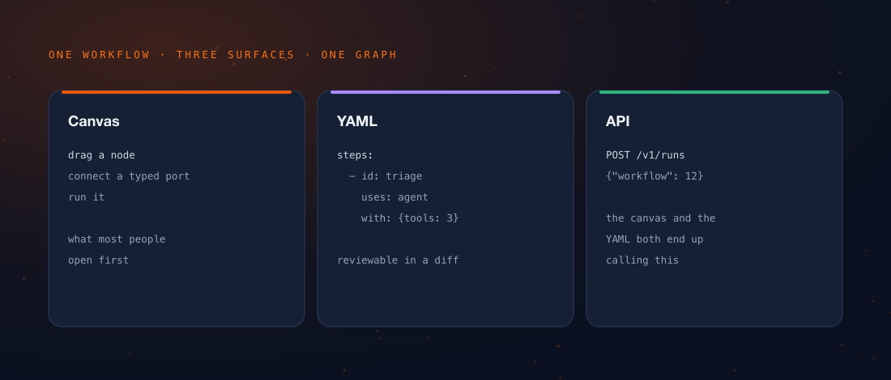

Workflow builders get judged on how fast you can get the first thing working,
which is a terrible benchmark, because *the first thing always works*. Every
tool in this category nails the first five minutes. That is what the first five
minutes are for.

The question I care about is day forty. The flow has eleven nodes now. There is
a loop. There is a retry that fires maybe twice a week for reasons nobody has
fully established. The person who built it has moved teams, and someone else is
on call at 2am looking at it for the first time.

Five decisions in Tamtree's builder are aimed at that person at 2am.

:::note
This describes the builder as specified. Where behaviour is normative in the
architecture document it is normative here too — these are contracts the
implementation has to satisfy, not preferences it is free to drift away from
when they get inconvenient.
:::

## 1. A ladder, not a wall

The usual shape of a visual builder is a lovely garden with a cliff at the edge.
Everything is delightful until you need the one thing the canvas cannot express,
and then the answer is "write a service". You have gone from dragging boxes to
provisioning infrastructure in a single step, and there is nothing in between.

A ladder is the better shape, where every rung is a smaller step than the cliff
it replaces:

:::steps
1. **Visual editing** — the canvas, trigger-first, each node configured against
   real input data.
2. **`{{ }}` expressions** — reach into a prior node's data without leaving the
   field you are typing in.
3. **Code nodes** — sandboxed Python or JavaScript, for the transformation the
   expression language deliberately refuses to do.
4. **The Python SDK** — author your own nodes and tools as first-class citizens,
   not as HTTP calls to a service you now have to operate.
5. **Git sync and the CLI** — the flow is text, reviewable in a pull request.
6. **The full REST API** — everything the UI can do, available to a program.
:::

The important property is that no rung makes you abandon the one below it. A
flow that reaches for the SDK on one node keeps the canvas for the other ten.
That is the whole idea, and it is exactly what a "just write code instead"
escape hatch fails to give you — because that hatch is not a rung, it is the
cliff with a handrail.

:::figure


Same workflow, three surfaces, one graph underneath. The canvas is not a
generator that emits YAML you then own — the canvas, the YAML and the API are
three windows onto the same object, which is why moving between them never
costs you anything.
:::

## 2. An expression language that says no on purpose

`{{ }}` expressions resolve against prior node data: `$json` for the current
item, `$node("Name")` for another node's output, `$vars` for the run's
variables, `$now`, `$env`, and a short list of others.

The interesting part is not what it evaluates. It is the list of things it flatly
refuses to.

:::ledger
| Allowed | Refused |
|---|---|
| Constants, whitelisted names, subscripts | Any dunder access |
| Arithmetic, comparisons, boolean operators | `import`, lambdas, comprehensions |
| Conditional expressions (`a if c else b`) | Assignment and the walrus operator |
| Calls to whitelisted functions and methods | Attribute access reaching Python internals |

:::

It parses with `ast.parse(mode="eval")` and rejects unknown node types **by
allowlist, never by blocklist**. That distinction sounds like pedantry right up
until someone is actively trying to climb out of your sandbox, at which point it
is the only thing that matters. A blocklist is a list of the attacks you have
already thought of. An allowlist is a list of the things you meant to permit.
Only one of those gets shorter as you learn more.

```python
# Whitelisted functions, in full. The shortness is the feature.
len min max sum abs round sorted str int float bool list dict

# Whitelisted string methods.
upper lower strip split join replace startswith endswith title
```

:::warn
`$vars` access is subscript-only: `{{ $vars["draft_ready"] }}`, never
`{{ $vars.draft_ready }}`. The dotted form raises, because attribute access on a
wrapped mapping only reaches its whitelisted methods. Everybody trips on this
exactly once, and the error message is written to make it exactly once.
:::

## 3. Variable scoping that survives a retry

This is the subtle one, and it is where home-grown orchestrators quietly break
in a way nobody notices for months.

A retried step has to see what the first attempt saw. If it does not, then
`{{ $vars['n'] + 1 }}` increments *twice* on a retry, your counter is wrong, and
it is only wrong under load — which is to say it is only wrong in production, on
the days that matter, and never once on your laptop.

::::cards
:::card{title="Snapshot at dispatch" tone="brand"}
The `$vars` snapshot an activity resolves against is fixed when the activity is
dispatched. A retried attempt sees precisely what the first attempt saw, which
makes the expression idempotent by construction rather than by discipline.
:::

:::card{title="Writes land forward" tone="compose"}
A write becomes visible to the *next* node. Never to the node that wrote it,
never to a node that has already run. A step that fails writes nothing at all.
:::

:::card{title="Children get their own scope" tone="good"}
Sub-workflows, crews, and every pass of a loop body start from a fresh scope
built from their own declarations. They neither inherit from the parent nor
write back to it.
:::
::::

:::error
The consequence of that third card is easy to miss and expensive to discover: a
loop's stop signal **cannot** travel in a variable. The loop body's scope does
not write back to the parent, so the parent never sees the flag flip. The loop
runs forever, and it does it silently. The stop condition has to travel on the
loop-carried item instead.
:::

That last one is the sort of thing you either write down in the specification or
you learn at 2am. We picked writing it down.

## 4. Test runs that test the thing you are editing

There is a distinction here that sounds pedantic for about four seconds.

:::compare
| | Editor test run | Triggered or API run |
|---|---|---|
| What executes | The **draft** definition | The **published** version |
| Payload | An optional trigger payload you supply | Whatever the trigger delivered |
| Where the payload lives | Run state — staged per run, gone when the editor closes | The trigger's own data |
| Replayable afterwards | Yes — the draft is snapshotted into the run | Yes |

:::

The draft gets snapshotted into the run's input, so a test run stays replayable
even after you have edited the flow underneath it. This matters more than it
sounds: without it, "re-run that test from an hour ago" silently runs *today's*
flow against yesterday's data and tells you nothing true about either.

And the trigger payload takes the same one-object shape the public API takes, so
`{{ $json[...] }}` resolves in the editor exactly as it will in production.
Anything else and your builder is a simulator with a subtly different physics
engine, which is worse than no simulator.

:::aside
Sample data that belongs to the *flow* rather than to one test is `pinned_data`
instead: saved with the draft, stripped at publish. The two are kept separate on
purpose — test payloads are throwaway, pinned data is part of how the flow was
authored and deserves to survive.
:::

## 5. Errors addressed to the person who built the flow

Missing keys resolve to `None` rather than raising, because that keeps authoring
forgiving — you can wire a node up before its upstream exists. The cost is that
the failure surfaces one step *later*, as an operation on nothing, and the
default message for that is a classic:

> `'NoneType' object is not subscriptable`

Which names no parameter, no expression, and no next move. It is a message
written by a Python interpreter for a Python programmer, and it has been handed
to a person who was, quite reasonably, dragging a box.

So the evaluator never lets an interpreter message through. It names the
sub-expression that was **empty** — not the one that raised — rendered back in
the author's own syntax:

```text
$json['data'] is empty (null), so ['items'] cannot be read from it
  field: fields.oops
  hint:  the "Fetch order" node returned no items for this input
```

::stat{value="workflow.invalid_expression" label="the error class an expression failure is given — never platform.unexpected, which would get sanitized as our fault and tell the author their workflow is not the problem"}

It is also deliberately **non-retryable**. Re-evaluating the same inputs is
deterministic, so a retry only delays the failure and then buries the real
message under a retry-exhausted one. Retrying a typo is not resilience.

:::tip
None of this ever appears in a feature comparison, and all of it decides whether
people can actually operate the thing. An error message is part of the product
surface. It is often the *only* part of the product surface someone sees on
their worst day with it.
:::

## What it adds up to

Composition is the payoff. A pipeline node can *be* a crew; a crew can call a
pipeline as a tool. Both share one run, one ledger, one guardrail policy and one
set of credentials — which is only possible because they are two primitives on
one engine, rather than two products with an integration between them.

:::button
[See how that compares to the alternatives](/blog/tamtree-vs-n8n-zapier-make/)
:::
