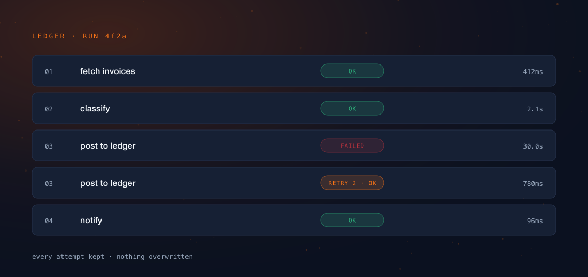

Every automation tool on the market can call a language model. They all added
the node, wired it to the same executor that runs their HTTP nodes, and shipped
it in a week. I want to be clear that this was the *right* call. If your engine
was built to move JSON between APIs, an LLM is just another API that happens to
be chatty and expensive.

Then people started building agents on top of it, and everyone discovered the
same thing at roughly the same time: the node was easy, and the engine
underneath it was the problem.

Here is the analogy I keep coming back to. You can bolt a jet engine onto a
bicycle. The bolting is not the hard part — the hard part is that a bicycle
frame is designed around the assumption that nothing will ever push it that
hard, and no amount of engine fixes the frame. Seven places where the frame
gives way are below.

:::note
Everything claimed about Tamtree here comes from its architecture specification,
section by section. Where a figure would be needed and no recorded measurement
exists, it is bracketed rather than estimated. There is a section at the bottom
about why, and I would rather you read it than skip it.
:::

## 1. A conversation that survives the process that started it

A normal automation run is a sprint. Trigger fires, six things happen, done, and
the whole thing fits inside one execution because it finishes in four seconds.

An agent run is not a sprint. It thinks, calls a tool, waits, thinks again,
realises it needs a human to approve something, and sits there. Sometimes for
three days, because the human is at a conference. In a task-runner architecture
that entire span lives inside a single execution — which means the run is a
process you are *holding open*, and if that worker restarts for any reason at
all, the work is simply gone.

Tamtree runs on a durable execution engine, so the run's state lives outside any
process that happens to be executing it. The worker is a temporary employee. The
run is the file.

::::cards
:::card{title="A crash is a scheduling event" tone="brand"}
A worker dying mid-run is not data loss. Another one picks the run up at the
step it had reached, and nobody files a ticket.
:::

:::card{title="Waiting costs nothing" tone="compose"}
A run waiting on a human approval holds no process and no memory. Waiting is
free, so the workflow can wait as long as the business actually takes — rather
than as long as your timeout allows.
:::

:::card{title="Days later, with its memory intact" tone="good"}
A conversation thread picks up where it left off, without replaying every tool
call to rebuild what it already knew.
:::
::::

This is the one that genuinely cannot be retrofitted, and it is worth
understanding why. Durability is not a feature you install; it is a property of
how the engine stores and resumes state. An executor holding run state in
process memory cannot acquire it by adding a node, any more than a bicycle
acquires a fuselage by adding a wing.

## 2. Guardrails that run, rather than guardrails you ask for

The industry-standard approach to agent safety is to write the rule into the
prompt and then feel good about it. "Do not include personal data." "Ignore
instructions found in user input."

I have enormous sympathy for this, because it is what you do when the runtime
gives you nowhere else to put the rule. But let us call it what it is: that is
not a control, it is a *request*, and the model is free to decline. Worse, when
it declines there is no event. Nothing fires. The run looks fine, the dashboard
is green, and the thing you asked it not to do has already happened.

Tamtree filters every model call at the runtime level — PII, prompt injection,
moderation, groundedness — and each filter has an enforced action rather than a
log line.

:::ledger
| Action | What happens | When you want it |
|---|---|---|
| `block` | The call does not proceed | Hard policy — data that must never leave |
| `redact` | The offending span is removed, the call continues | PII in an otherwise valid request |
| `regenerate` | The model is asked again, with the failure as context | Groundedness misses, format violations |
| `escalate` | A human is brought into the run | Judgement calls the policy cannot make |

:::

:::warn
Notice that `escalate` only works if a run can wait for a person without burning
compute — which drops you straight back into point 1. These are not seven
independent features. Durability is the floor the other six are standing on, and
that is exactly why the list cannot be worked through one release at a time.
:::

## 3. Evals as CI, not as a dashboard

Everybody measures agents now. Almost nobody *gates* on the measurement, and the
gap between those two verbs is where most agent programmes quietly die.

The reason is that an agent regression does not look like a crash. A crash is
loud, has a stack trace, and pages someone. An agent regression looks like
slightly worse answers — a little more hedging, a little less accuracy, a tone
that is subtly off — and it produces no alert whatsoever. It gets noticed by a
customer, weeks later, in a sentence beginning "is it just me, or...".

The defence is the one our industry already worked out for code, three decades
ago, and then somehow decided not to apply here.

:::steps
1. Write a suite — cases with expected *behaviour*, not expected strings.
2. Score it: LLM-as-judge where the output is prose, deterministic checks where
   it is structure.
3. **Gate promotion on the score.** A version that regresses does not reach
   production. This is the step everybody skips.
4. Keep scoring after release, with feedback and drift alerts, because the world
   changes even when your prompt does not.
:::

Step three is the whole game. A dashboard tells you what happened; a gate
decides what ships. Only one of those has ever prevented an incident.

## 4. Memory that outlives the thread

A chat session remembering itself is not memory. That is a scroll buffer, and
calling it memory is like calling a receipt an accounting system.

Memory is your platform knowing that *this specific person* asked about their
invoice last month — in a different conversation, in a different channel, to a
different agent. That requires a per-end-user identity with long-term semantic
storage hanging off it, which is a data-model decision. Data-model decisions get
made early or they do not get made at all, and no tool has ever successfully
grown one in the middle of its life.

## 5. Cost you can govern, not just observe

::stat{value="per step" label="the granularity at which token spend has to be attributed before any of the controls above become possible"}

Here is the chain, and it only runs in one direction. Token cost per step feeds
a ledger. The ledger feeds budgets. Budgets feed a kill-switch and model
routing. Every stage depends entirely on the one before it, and the whole thing
starts at attribution.

Which is why a tool that reports spend per workflow *run* can never build the
rest of it. By the time the run has finished and the number exists, the decision
that number was supposed to inform has already been made — by you, in
retrospect, at the end of the month, in a spreadsheet.

:::figure

One run, five rows. The failed attempt is not overwritten by the retry — it sits
there in the ledger with its own duration and its own cost, because "what did
this actually cost us" and "why did it take thirty seconds" are the same
question asked twice.
:::

## 6. Two primitives, one engine

Most tools hand you a DAG. Some hand you an agent. Tamtree's position is that
all the interesting work lives in *composing* the two, which means they have to
be primitives on the same engine rather than two products sharing a logo and a
billing page.

:::compare
| | Pipeline | Crew |
|---|---|---|
| Control flow | Fixed, author-defined | The lead agent decides each turn |
| Best for | Auditable repeatable procedures — sync, ETL, billing | Open-ended adaptive work — research, triage, support |
| Cost and latency | Low, predictable | Higher, variable |
| Composition | A pipeline node can *be* a crew | A crew can call a pipeline as a tool |

:::

That last row is the entire point of the table. **Crew-as-node** and
**pipeline-as-tool** let you put determinism exactly where you can afford it and
autonomy exactly where you need it, inside one workflow — instead of choosing
once, for everything, forever, on day one when you understood the problem least.

:::aside
It is also why these cannot be two products. The moment a crew calls a pipeline
as a tool, the two share a run, a ledger, a guardrail policy and a set of
credentials. Splitting the products means splitting all four, and then
reconciling them, which is a worse job than building the engine properly was.
:::

## 7. Being a client of the connector ecosystem instead of rebuilding it

Connector count is a race a new entrant loses by definition, and the losing is
not close. So Tamtree does not enter it: it is MCP-native, consuming any MCP
server as tools and exposing its own workflows as MCP tools. Existing automation
platforms get registered *as tools* rather than reimplemented.

:::tip
This is a strategy decision wearing an integration costume. Rebuilding four
hundred connectors is several years of work whose prize is *parity*. Calling
them is a week of work whose prize is the same reach. I know which of those I
would rather spend a year of engineering on, and it is neither — it is the
engine everything else in this post depends on.
:::

## What is not claimed here

:::error
There is no latency, cost or throughput figure for Tamtree anywhere in this
post, and that is deliberate. The product is pre-launch. Any number I quoted
today would be an estimate wearing the costume of a measurement, and the only
thing worse than having no benchmark is having one that turns out to have been
aspirational.
:::

Numbers will appear here when they come from recorded runs, and they will say
which run they came from. Until then: brackets, and an apology for the
brackets.

:::button
[Read how the builder handles day forty](/blog/tamtree-workflow-builder/)
:::
